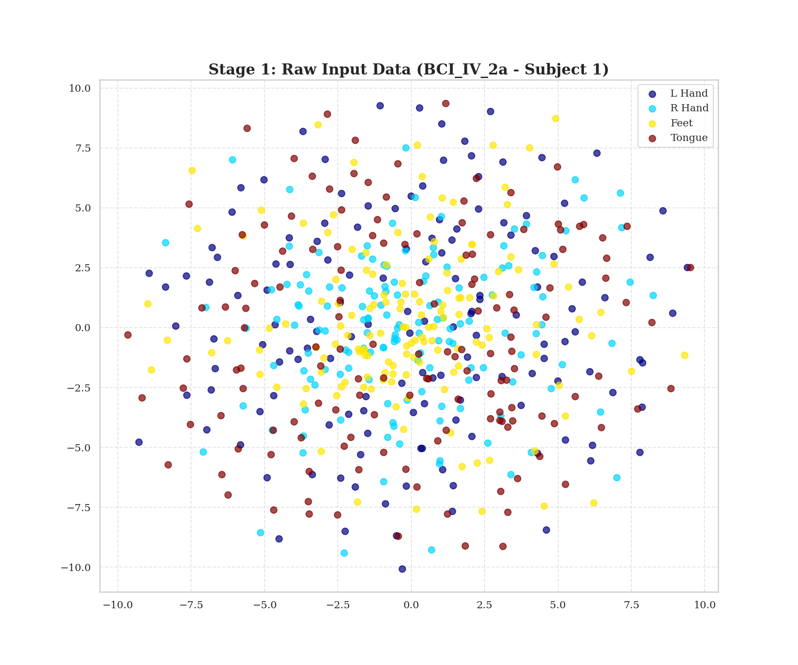
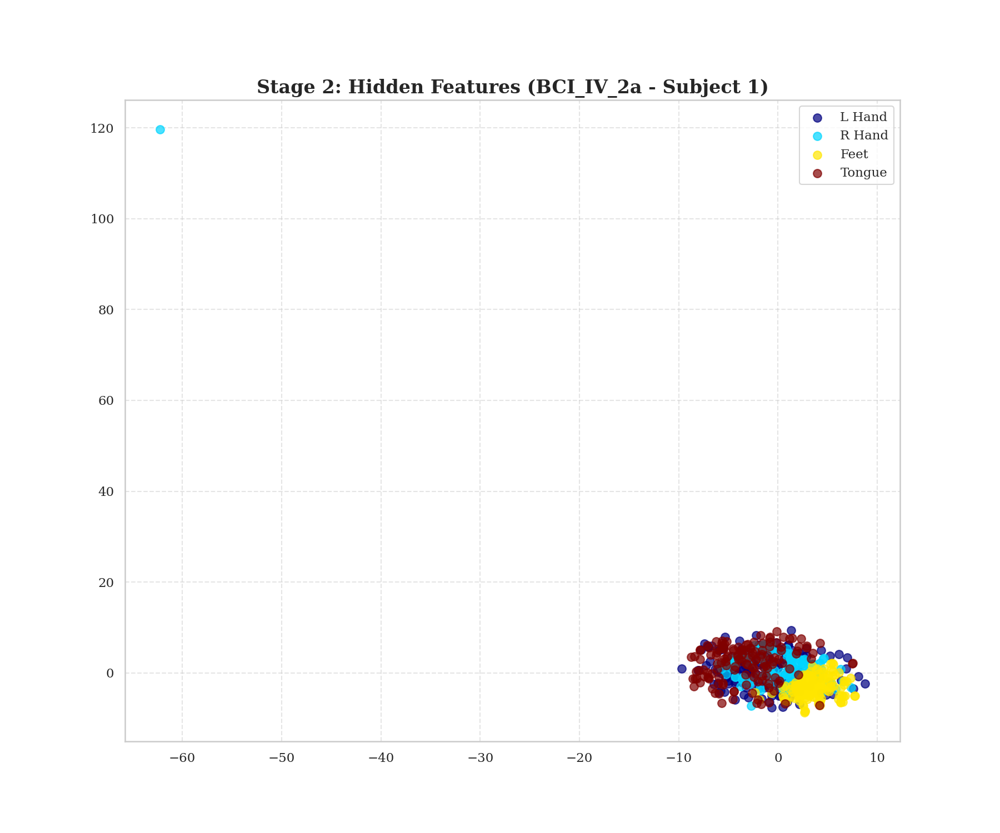
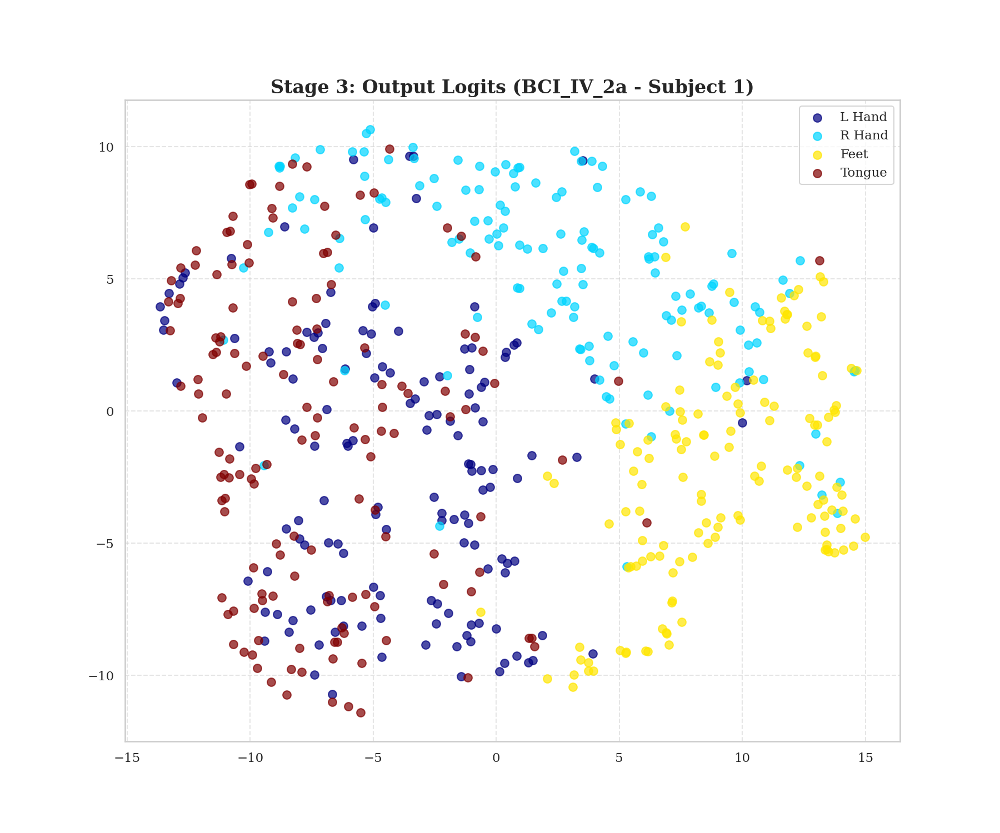
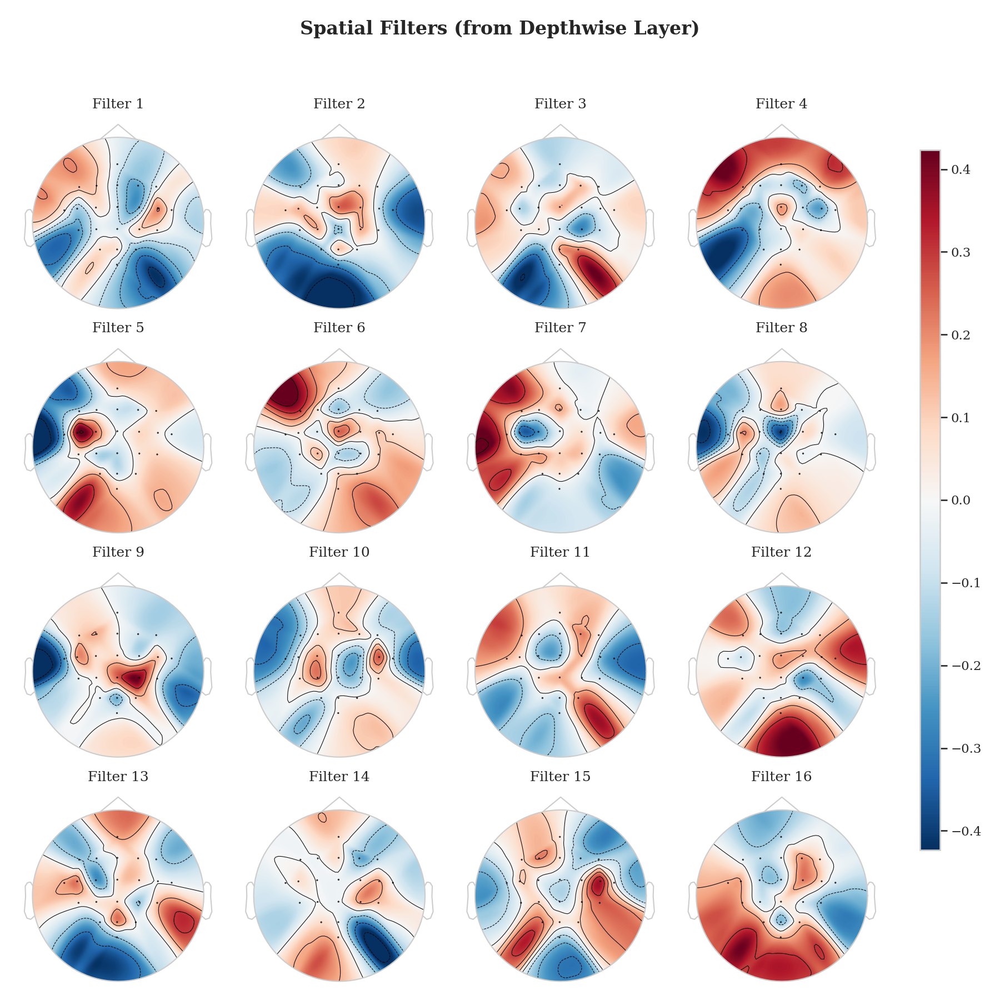
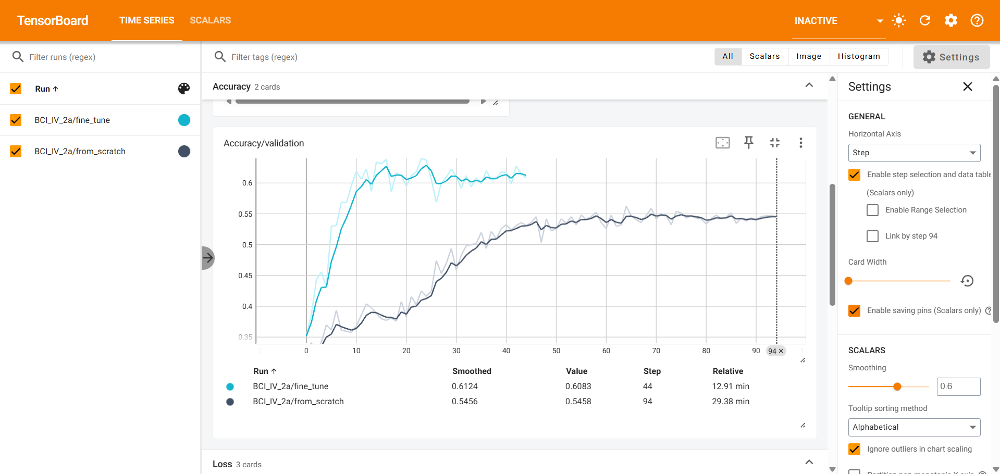

# EEG Classification and Analysis: EEGNet and Foundation Models

This repository contains my work for the Recruitment Task. The project focuses on the implementation, validation, and interpretation of deep learning models for EEG-based Brain-Computer Interfaces (BCIs).

---

## Table of Contents

1.  [Project Overview](#project-overview)
2.  [Project Structure](#project-structure)
3.  [Setup and Installation](#setup-and-installation)
4.  [How to Run](#how-to-run)
5.  [Task 1: EEGNet Analysis & Results](#task-1-eegnet-analysis--results)
6.  [Task 2: BIOT Foundation Model Analysis & Results](#task-2-biot-foundation-model-analysis--results)
7.  [Next Steps](#next-steps)

---

## Project Overview

The overall goal of this technical assessment is to evaluate skills in EEG data analysis, deep learning, and research comprehension. The project is divided into three main tasks:

*   ✅ **Task 1: EEGNet Implementation & Analysis**
    *   Implemented the EEGNet-v4 model from scratch in PyTorch.
    *   Validated the model using a "Leave-One-Subject-Out" cross-validation scheme on three datasets from the reference paper (`BCI_IV_2a`, `Lee2019`, `BNCI2015_001`).
    *   Performed in-depth interpretability analysis by visualizing learned filters, multi-stage feature separation (t-SNE), and gradient flow.

*   ✅ **Task 2: Transformer-based Foundation Model (BIOT)**
    *   Implemented a training pipeline for the BIOT foundation model.
    *   Conducted a comparative analysis of training "from scratch" vs. "fine-tuning" with pre-trained weights on two datasets.
    *   Analyzed training dynamics with TensorBoard and interpreted the model's learned spatial and temporal filters.

*   [ ] **Task 3: Paper Selection and Critical Reflection**
    *   *Upcoming:* Select and critically analyze a recent, high-impact research paper in the field of EEG analysis.

---

## Project Structure

The repository is organized as follows:

```
.
├── analysis/
│   ├── generate_all_multistage_tsne.py # Generates 3-stage t-SNE plots for EEGNet
│   ├── visualize_biot_filters.py       # Generates filter plots for BIOT
│   └── recalculate_gradients.py        # Generates gradient comparison plots for EEGNet
│
├── data/
│   └── load_data.py                    # Handles downloading of all datasets
│   └── preprocessing.py                # EEGPreprocessor class
│
├── experiments/                        # Root for saved models and logs from Task 1
│   └── task1_eegnet/
│
├── models/
│   ├── eegnet.py                       # EEGNet model class
│   └── biot.py                         # BIOT model class (from official repo)
│   └── biot/                           # Directory for saved BIOT models
│
├── pretrained_biot/
│   ├── EEG-six-datasets-18-channels.ckpt
|
├── model/
│   ├── train_eegnet.py                 # Main training script for Task 1
│   └── train_biot.py                   # Main training script for Task 2
│
└── README.md                           # This file
```

---

## Setup and Installation

1.  **Clone the repository:**
    ```bash
    git clone https://github.com/TyroneZeka/EEG-and-Foundational-Models.git
    cd EEG-and-Foundational-Models
    ```

2.  **Create and activate a virtual environment (recommended):**
    ```bash
    python -m venv env
    source env/bin/activate  # On Windows, use `env\Scripts\activate`
    ```

3.  **Install the required dependencies:**
    ```bash
    pip install torch numpy pandas scikit-learn matplotlib mne tensorboard tqdm einops linear-attention-transformer
    ```

---

## How to Run

### 1. Task 1: Train EEGNet Models

This script will run the full LOSO cross-validation for the three required datasets.
```bash
python model/train_eegnet.py
```

### 2. Task 2: Train BIOT Models

This script will run the "from scratch" vs. "fine-tuning" experiments for two datasets.
```bash
python model/train_biot.py
```

### 3. Monitor with TensorBoard

View live metrics for both tasks.
```bash
tensorboard --logdir logs/
```

### 4. Generate All Visualizations

After training is complete, run the analysis scripts to generate all figures.
```bash
python analysis/generate_all_multistage_tsne.py
python analysis/recalculate_gradients.py
python analysis/visualize_biot_filters.py
```

---

## Task 1: EEGNet Analysis & Results

The EEGNet model was successfully implemented and validated. The training pipeline confirmed that our model reproduces the benchmarks from the reference paper with high fidelity. In-depth interpretability analysis confirmed the model learns neurophysiologically relevant patterns.

| Dataset | Our Implementation (Mean Accuracy) | Paper Benchmark (Table 5) | Status |
| :--- | :--- | :--- | :--- |
| **BCI_IV_2a** | 44.0% | 43.3% | ✅ **Reproduced** |
| **Lee2019** | 64.9% | 66.6% | ✅ **Close** |
| **BNCI2015_001**| 59.5% | 59.2% | ✅ **Reproduced** |

### Model Interpretability Visualizations

#### Multi-Stage t-SNE Analysis

These plots demonstrate the model's ability to learn a separable feature space, progressing from raw data to hidden features to final output logits.

*(Example of how an image is embedded. The paths below point to figures generated by the analysis scripts.)*
**`BNCI2014001` - Fold 1**
| Stage 1: Raw Input | Stage 2: Hidden Features | Stage 3: Output Logits |
| :---: | :---: | :---: |
|  |  |  |

#### Learned Filters (Spatial & Temporal)

These plots confirm that the model learns neurophysiologically relevant patterns. The spatial filters focus on motor cortex regions, and the temporal filters are sensitive to Alpha/Beta frequency bands.



---

## Task 2: BIOT Foundation Model Analysis & Results

The BIOT foundation model was evaluated to test the effectiveness of transfer learning.

### Performance: Fine-Tuning vs. From Scratch

Fine-tuning consistently and significantly outperformed training from scratch, demonstrating the power of leveraging pre-trained knowledge.

| Dataset | From Scratch (Accuracy) | Fine-Tuning (Accuracy) | Performance Gain |
| :--- | :--- | :--- | :--- |
| **BNCI2014001** | 52.5% | **58.6%** | **+6.3%** |
| **BNCI2015001** | 74.5% | **81.2%** | **+7.4%** |

### Training Dynamics

Analysis in TensorBoard shows the fine-tuned model converges dramatically faster and to a higher performance ceiling.



---

## Next Steps

-   ✅ **Task 1: EEGNet Implementation & Analysis**
-   ✅ **Task 2: Transformer-based Foundation Model (BIOT)**
-   [ ] **Task 3: Paper Selection and Critical Reflection**
